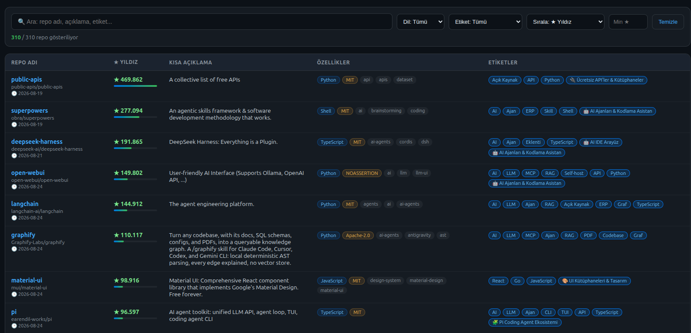
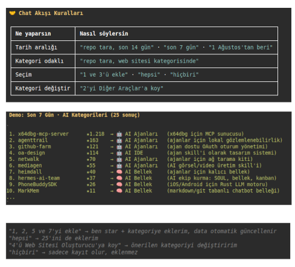

# ⭐ My GitHub Manager

**yunusozkarakasoglu** hesabının star'ladığı tüm repoların **tek dosyalık, aranabilir** HTML kataloğu.
GitHub star'larını ve kategori (Lists) üyeliklerini otomatik çeker, tarayıcıda kullanılabilir bir kataloğa dönüştürür.

<p align="center">
  
  <br><em>📚 Repo listesi görünümü</em>
</p>

<p align="center">
  
  <br><em>🔍 Yeni repo tarama akışı</em>
</p>

---

## ℹ️ Bu Repo Nedir?

**My GitHub Manager**, GitHub'da star'ladığım tüm repoları **süzülmüş, kategorize edilmiş ve aranabilir** bir kütüphaneye dönüştüren kişisel bir araç deposudur. GitHub'ın dağınık star listesi yerine; kullanım amacına göre 30 kategoriye ayrılmış, **tamamı açık kaynak + ücretsiz + kaliteli** repolardan oluşan bir koleksiyon sunar.

### 🎯 Ne İşe Yarar?

- **Proje kütüphanesi** — Yeni bir projeye başladığında GitHub'da saatlerce aramak yerine, kategorilere ayrılmış bu kütüphaneden "bu projede hangi repoyu kullanabiliriz?" sorusuna saniyeler içinde cevap buluruz.
- **Yeni repo keşfi** — "Repo tara" komutuyla son günlerde oluşturulan, ilgi alanlarına uygun yeni açık kaynak repoları otomatik keşfeder; onayla kataloğa eklenir.
- **Canlı katalog** — Tek dosyalık HTML katalog (GitHub Pages'te yayında): sol menüden kategori seç, ara, filtrele, yıldıza göre sırala.
- **Hızlı arama** — `ara.py` ile 300+ repoyu anahtar kelime, kategori, dil ve özellik etiketlerine göre anında tarar.

> 💡 **Kısacası:** Bu repo, GitHub karmaşasından arındırılmış, **kendi seçtiğim kaliteli açık kaynak araçlarımın** hem görsel kataloğu hem de akıllı tarama/asistan altyapısıdır.

---

## 🤖 Vizyon: Kişisel GitHub Asistanı

Bu repo sadece bir katalog değil — **kişisel GitHub asistanımızın beyni**. Amacı, GitHub'ı projelerimiz için ilham alacağımız, kendi branşlarımıza uygun kategori ve repolarla **izole bir veri kaynağına** dönüştürmek.

| Görev | Araç / Komut |
|---|---|
| 🔍 Yeni repo araştırma | `python3 tara.py` (son aramadan itibaren — kaçıran repo yok) |
| 📚 Projeler için özellik araştırma | `python3 ara.py "pdf"` / `"projem için pdf işi yapan repo bul"` |
| 💡 Öneriler alma | kategori + etiket sistemi + asistan değerlendirmesi |
| 🗂️ Katalog yönetimi | `./guncelle.sh` (çek → üret → commit → push) |
| 🕒 Otomatik sabah raporu | `github_daily_scan.sh` + systemd timer (her sabah 08:00) |
| 🧠 Asistan davranış kuralları | `AGENTS.md` — pi asistanı bu repoyu açınca otomatik okur |

> 🧭 Gelecek özellikler için [`ROADMAP.md`](ROADMAP.md) bölümüne bak.

---

## ✅ Gereksinimler / Bağımlılıklar

| Araç | Neden gerekli | Kurulum |
|---|---|---|
| **GitHub CLI (`gh`)** | GitHub API erişimi — star/liste çekme, repo ekleme | `sudo apt install gh` + `gh auth login` |
| **Python 3.8+** | Scriptleri çalıştırmak için | `sudo apt install python3` |
| **Git** | Güncellemeleri commit/push etmek | `sudo apt install git` |
| **`notify-send`** | Sabah raporu masaüstü bildirimi (opsiyonel — yoksa sessiz geçer) | `sudo apt install libnotify-bin` |
| **systemd (user)** | `github_daily_scan.sh`'i her sabah 08:00'de otomatik tetikleme | Debian/Ubuntu'da hazır |
| **CTranslate2 + NLLB-200** (yerel çeviri, opsiyonel) | Rapor açıklamalarını Türkçeye çevirir (`~/.ct2-env` + `~/ct2-nllb`, ~1.5GB) | `python3 -m venv ~/.ct2-env` + pip kurulumu |

`gh` kurulumu ve giriş:
```bash
sudo apt install gh        # Debian/Ubuntu
gh auth login              # github.com hesabına giriş
```

> ⚠️ Listeleri okuyabilmek için `gh` token'ında **`user`** scope'u olmalı:
> ```bash
> gh auth refresh -s user
> ```

---

## 🚀 Hızlı Başlangıç (İlk Kurulum)

```bash
# 1) Repoyu kopyala
git clone https://github.com/yunusozkarakasoglu/My-Github-Manager.git
cd My-Github-Manager

# 2) Kataloğu aç (index.html'i tarayıcıda çift tıkla — sunucu gerekmez)
```

---

## 🖥️ Katalog Özellikleri (`index.html`)

- 🔍 **Arama** — repo adı, açıklama, etiket, kategori üzerinde canlı arama
- 📂 **Sol panel** — açılır/kapanır kategori menüsü (☰ butonu; "Tümü" + 30 kategori)
- 🎯 **Filtreler** — dil, etiket, minimum ★, sıralama (★ / A-Z / son güncelleme)
- 📋 **Tablo sütunları:**
  | Sütun | Açıklama |
  |---|---|
  | **Repo Adı** | Repo linki + sahip + son güncelleme tarihi |
  | **★ Yıldız** | Yıldız sayısı + orantılı renk çubuğu |
  | **Kısa Açıklama** | Reponun ne yaptığı |
  | **Özellikler** | Dil, lisans, topic rozetleri |
  | **Etiketler** | Otomatik etiketler (AI, MCP, Self-host, Docker...) |
- 🏷️ **Otomatik etiketler** — her repo için anahtar kelime analiziyle üretilir
- 📱 **Responsive** — mobilde çalışır, dar ekranda sidebar otomatik kapanır

---

## 🔄 Güncelleme (yeni star / kategori değişince)

### Tek komut:
```bash
./guncelle.sh
```
Bu script sırayla:
1. GitHub'dan **star listesini** ve **kategori üyeliklerini** çeker
2. **`data.json`**'ı günceller (benim okuduğum ana JSON veri dosyası — etiketler dahil)
3. **`index.html`** kataloğu yeniden üretir
4. **`repo-indeksi.txt`** (grep indeksi) yeniden üretir
5. Değişiklikleri commit + push eder
6. GitHub Pages otomatik yeniden derlenir (2-3 dk)

### Elle:
```bash
python3 guncelle.py --fetch   # veriyi GitHub'dan çek + data.json + index.html + repo-indeksi.txt üret
```

> 🔄 **Tara sonrası otomatik güncelleme:** `tara.py` ile yeni repo eklediğinde, script ekleme sonrası
> `data.json` + `index.html` + `repo-indeksi.txt`'i **kendiliğinden tazeler** — ayrıca "kataloğu güncelle" demene gerek kalmaz.

> 💡 **Asistana söyle:** *"kataloğu güncelle"* → `./guncelle.sh` çalıştırılır.

---

## 🔍 Yeni Repo Tarama (`tara.py`)

Son günlerde oluşturulan, kategorilerine uygun **yeni açık kaynak repoları** bulur.

> 🕒 **Son arama tarihi hatırlanır!** `.son-tarama.json` dosyası son tarama tarihini saklar.
> Her tarama bitince güncellenir; böylece **hiçbir repo kaçmaz** — aralık üst üste binmez, zincirleme taranır.

### Kullanım:
```bash
python3 tara.py                           # 📌 ÖNERİLEN: SON ARAMADAN bugüne kadar tarar (ilk seferde 30 gün)
python3 tara.py --gun 30                  # son 30 günde oluşturulanlar (SORAR)
python3 tara.py --gun 30 --auto           # ⚡ soru sormadan uygunları otomatik ekler
python3 tara.py --gun 30 --no-add         # sadece tara, ekleme yapma
python3 tara.py --since 2026-08-01        # belirli tarihten beri
python3 tara.py --since X --until Y       # tarih aralığı (son tarama tarihi bu aralığın sonuna ayarlanır)
python3 tara.py --gun 14 --kategori "AI"  # yalnızca belirli kategori
python3 tara.py --gun 30 --kaydet         # sonucu tarama.md olarak kaydeder
python3 tara.py --gun 7 --max 5           # kategori başına sonuç sayısı (varsayılan 8)
python3 tara.py --gun 30 --min-stars 100  # isteğe bağlı min ★ (varsayılan: kriter yok)
```

### Çıktı sütunları:
| Repo Adı | URL | Tarih | Özellikler (ne yapar) | ★ | Lisans | Kategori |

### Kriterler (otomatik uygulanır):
- ✅ **Lisans kesinlikle tamamen açık kaynak + ücretsiz** (OSI onaylı: MIT, Apache, GPL, AGPL, MPL, BSD, CC0...)
- ✅ Arşivlenmemiş, aktif repolar
- ✅ Zaten star'lı olanlar hariç tutulur
- ⛔ Min ★ kriteri yok (istemezsen) — küçük ama değerli repolar da yakalanır
- 🗂️ Her sonuç için **önerilen kategori** otomatik eşleştirilir (TR+EN anahtar kelimelerle)

> 💡 **Asistana söyle:** *"repo tara"* → senin için çalıştırır (argümansız = son aramadan itibaren), listeyi sunar ve **sana sorar** hangilerini ekleyeceğini (manuel). *"repo tara --auto"* dersen hepsini otomatik ekler.

---

## 🎯 Bu Katalog Neden Var? (Proje Kütüphanesi)

Bu repo, GitHub karmaşasına girmeden projelerinde kullanabileceğin **süzülmüş bir kütüphane**.
Tüm repolar önceden doğrulanmış: **tamamen açık kaynak + ücretsiz + kaliteli**.

**İlerideki iş akışı:**
```
SEN: "xxx repomuzu incele ve bu repolar içinden bu projemizde
      kullanabileceğimiz repoları (tamamı ya da herhangi bir özelliği) listele."
ASİSTAN: 1) Projenin ihtiyaçlarını anlar
         2) repo-indeksi.txt / ara.py ile hızlıca tarar
         3) Adayların README'lerini okur, özellikleri çıkarır
         4) Kategori bilgisiyle öneri listesi sunar
```

## ⚡ Hızlı Arama (`ara.py`)

```bash
python3 ara.py --indeks              # indeks dosyalarını (yeniden) üret
python3 ara.py "pdf"                 # anahtar kelime ara
python3 ara.py "pdf üretim"          # çok kelimeli arama (hepsi eşleşmeli)
python3 ara.py "rag" --kategori "Bellek"  # kategori filtresi
python3 ara.py "crm" --lang python   # dil filtresi
python3 ara.py "erp" --min 1000      # min ★ ile
python3 ara.py --liste               # tüm kategoriler + sayılar
```

**Veri dosyaları (senin için hızlı tarama):**
| Dosya | İçerik |
|---|---|
| `data.json` | **ANA veri dosyası (JSON)** — her repo: ad, url, açıklama, dil, ★, lisans, topic, kategori + **otomatik etiketler**. Asistan bu dosyayı okur; her güncellemede tazelenir |
| `repo-indeksi.txt` | JSON'dan türetilen **grep dostu** indeks → `grep -i "pdf" repo-indeksi.txt` ile anlık arama |

> 💡 Asistanına *"projem için pdf işi yapan repo bul"* gibi bir istek verdiğinde, `data.json` üzerinden saniyeler içinde tarar ve önerir.

> 💡 Asistanına *"projem için pdf işi yapan repo bul"* gibi bir istek verdiğinde, bu indeks dosyaları üzerinden saniyeler içinde tarar ve önerir.

---

## 🗂️ Dosya Yapısı

| Dosya | Açıklama |
|---|---|
| `index.html` | Katalog (tek dosya — tarayıcıda aç, sunucu gerekmez) |
| `guncelle.py` | Veriyi GitHub API'den çeker, `index.html`'i üretir |
| `guncelle.sh` | Tek komutla güncelleme (çek → üret → commit → push) |
| `tara.py` | 🔍 Yeni repo tarama aracı |
| `.son-tarama.json` | 🕒 Son tarama tarihi (tara.py otomatik günceller — son aramadan itibaren tarar) |
| `ara.py` | ⚡ Hızlı arama / indeks aracı (proje kütüphanesi) |
| `repo-indeksi.txt` | grep dostu indeks (data.json'dan türetilir) |
| `data.json` | Son veri önbelleği (repo + kategori üyelikleri) |
| `tarama.md` | Son tarama çıktısı (—kaydet ile oluşur) |
| `assets/` | README görselleri (repo listesi + tarama akışı ekran görüntüleri) |

---

## 🖥️ Görüntüleme Seçenekleri

1. **Yerel:** `index.html`'i tarayıcıda aç (çift tık — internet gerekmez)
2. **GitHub Pages (canlı):** https://yunusozkarakasoglu.github.io/My-Github-Manager/
   - Pages açıksa, her `git push` sonrası otomatik güncellenir
   - `.nojekyll` dosyası sayesinde Jekyll işleme kapalıdır (sorunsuz statik servis)

---

## 🧠 Veri Kaynağı

- **Star listesi:** GitHub REST API (`GET /user/starred`)
- **Kategori üyelikleri:** GitHub GraphQL (`viewer.lists`)
- Tüm işlemler ücretsiz GitHub API limitleri içinde çalışır (token başına 5000 istek/saat)

---

## 🛠️ Karşılaşılabilecek Sorunlar ve Çözümleri

| # | Sorun | Belirti | Çözüm |
|---|---|---|---|
| 1 | **gh girişi yok** | `gh: To use GitHub CLI... please run gh auth login` | `gh auth login` ile giriş yap |
| 2 | **Token scope eksik** | `INSUFFICIENT_SCOPES ... requires one of: ['user']` (liste işlemlerinde) | `gh auth refresh -s user` ile scope ekle |
| 3 | **API limiti aşıldı** | `API rate limit exceeded` / HTTP 403 | Scriptler otomatik bekleyip tekrar dener; 1 saat sonra tekrar dene (limit: 5000/saat, arama 30/dk) |
| 4 | **tara.py asılı kalıyor** | Uzun süre çıktı yok | Script URL'leri encode eder ama eski sürüm kalıntısı olabilir → `git pull` ile güncelle; `python3 -u tara.py` ile çalıştır (önbelleksiz) |
| 5 | **Türkçe/özel karakter hatası** | `JSONDecodeError` / boş sonuç | Komut satırında kategori adlarını tırnak içinde ver: `--kategori "AI"` |
| 6 | **Repo kategoriye eklenmiyor** | "Liste bulunamadı" / emoji eşleşmiyor | `tara.py` listeleri her çalıştırmada taze çeker; sorun devam ederse `gh api graphql -f 'query={ viewer { lists { nodes { name } } } }'` ile listeyi doğrula |
| 7 | **Bir repo birden fazla listeden düşüyor** | Repo sadece son eklenen listede kalıyor | ⚠️ `updateUserListsForItem` **eklemez, DEĞİŞTİRİR** — çoklu listede kalması için tüm liste ID'lerini birlikte vermek gerekir (scriptler bunu doğru yapar) |
| 8 | **GitHub Pages build hatası** | Pages durumu `errored` — "Page build failed" | Repoda `.nojekyll` dosyası olmalı (zaten var — silme); Jekyll işlemeyi kapatır |
| 9 | **index.html eski görünüyor** | Yeni star/liste yansımamış | `./guncelle.sh` çalıştır; Pages canlıysa build 2-3 dk sürer, bekle |
| 10 | **data.json bozuk/eski** | guncelle.py hata veriyor | `python3 guncelle.py --fetch` ile veriyi yeniden çek (--fetch olmadan önbelleği kullanır) |
| 11 | **tarama sonucu boş** | "0 yeni repo" | Tarih aralığını genişlet (`--gun 60`), `--kategori` filtresini kontrol et, `--min-stars` verdiysen düşür veya kaldır |
| 12 | **gh api yavaş/çöküyor** | Timeout / bağlantı hatası | İnterneti kontrol et; `gh api rate_limit` ile kalan limiti gör; birkaç dk bekle |
| 13 | **git push reddediliyor** | `Authentication failed` / `rejected` | `git remote -v` ve `gh auth status` kontrol et; kimlik: `git config user.name` + `user.email` |
| 14 | **Python yok/eski** | `python3: command not found` | `sudo apt install python3` (Debian/Ubuntu) — 3.8+ gerekli |
| 15 | **Yıldız sayısı sayfada farklı** | GitHub UI ile API farklı | GitHub cache/gecikmesi — F5, birkaç dk bekle |

---

## ⚠️ Dikkat Edilmesi Gerekenler

- ⛔ **Star silme işlemi geri alınamaz** — unstar edilen repo bir daha "ne zaman star'ladım" bilgisini taşımaz. Temizlik öncesi `data.json`/yedek alın.
- 🔄 **`updateUserListsForItem` eklemez, değiştirir** — bir repoyu 2. listeye eklerken 1. listeden düşmemesi için scriptler tüm liste ID'lerini tek çağrıda verir. Elle müdahalede buna dikkat et.
- 🧪 **Hobi & Diğer listesi boş** — o kategorideki repolar yeni mantığa uymadığı için star'dan düşürüldü. İstersen tekrar eklenebilir.
- 🕒 **GitHub Pages build gecikmesi** — push sonrası canlı sitedeki güncelleme 2-3 dk sürebilir.
- 💰 **Hepsi ücretsiz** — tüm scriptler GitHub'ın ücretsiz API limitleriyle çalışır; ek ücret yok. Ama arama API limiti (30/dk) aşılırsa script otomatik bekler.
- 📁 **`index.html` tek dosyadır** — sunucu/database gerekmez; sadece tarayıcıda aç. İnternet gerektirmez (veri gömülüdür).
- 🔐 **`gh` token'ı `user` scope'u olmadan liste okuyamaz** — `gh auth refresh -s user` bir kez yapılmalı.
- 📊 **Kategoriler GitHub Lists'te yaşar** — GitHub star sayfası klasör göstermez; düzen bu katalogda ve Lists'te görünür.
